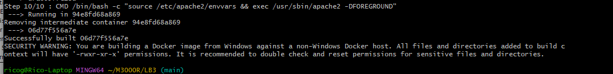
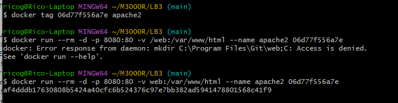
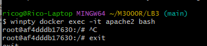
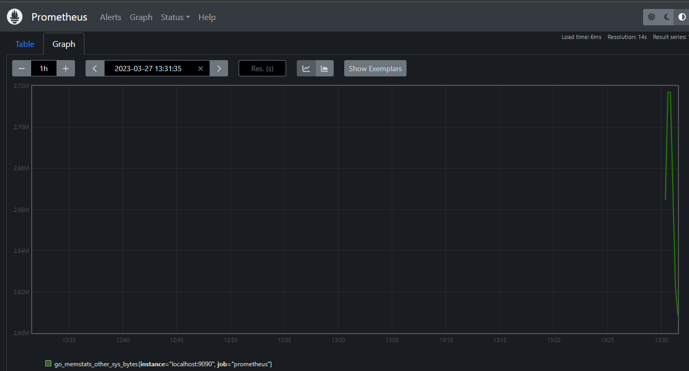

# LB3

## Inhaltsverzeichnis
- [LB3](#lb3)
  - [Inhaltsverzeichnis](#inhaltsverzeichnis)
  - [Docker](#docker)
  - [Befehle](#befehle)
  - [Netzwerkplan](#netzwerkplan)
    - [Dockerfile](#dockerfile)
      - [Container starten](#container-starten)
    - [Service Überwachung](#service-überwachung)
    - [Container Sicherheit](#container-sicherheit)
      - [Read-Only](#read-only)
  - [Kubernetes](#kubernetes)
    - [Deployment yaml erstellen](#deployment-yaml-erstellen)
    - [Service](#service)
  - [Persönliche Lernentwicklung](#persönliche-lernentwicklung)
    - [Vergleich Vorwissen - Wissenszuwachs](#vergleich-vorwissen---wissenszuwachs)
      - [Vorwissen im Bezug zum Modul und LB3](#vorwissen-im-bezug-zum-modul-und-lb3)
      - [Neues Wissen](#neues-wissen)
    - [Reflexion](#reflexion)
      - [Tag 5](#tag-5)
      - [Tag 6](#tag-6)


## Docker
Docker ist eine Freie Software zur Isolierung von Anwendungen mit Hilfe von Containervirtualisierung. Docker vereinfacht die Bereitstellung von Anwendungen, weil sich Container, die alle nötigen Pakete enthalten, leicht als Dateien transportieren und installieren lassen.
<br>

## Befehle
| Befehl            | Funktion                                             |
| -------------     | ---------------------------------------------------- | 
| ```docker pull```      | Holt ein Image. |
| ```docker run```      | Started VM mit dem ausgewähltem Image. |
| ```docker ps```      | Zeigt laufende Maschinen. |
| ```docker version```      | Zeigt die Docker Version von Echo-Client und Server an. |
| ```docker images```        | Listet alle Docker Images auf. |
| ```docker exec```       | Führt einen Befehl in einem laufenden Container aus. |
| ```docker search```    | Durchsucht das Docker Hub nach Images. |
| ```docker attach```      | Hängt etwas an einen laufenden Container an. |
| ```docker commit```   | Erstellt ein neues Image mit den Änderungen, die an einem Container vorgenommen worden sind. |
| ```docker stop```   | Haltet die gewünschte Maschine an. |

<br>

## Netzwerkplan

### Dockerfile

```
#
#	  Einfache Apache Umgebung
#
FROM ubuntu:14.04
RUN apt-get update
RUN apt-get -q -y install apache2 
# Konfiguration Apache
ENV APACHE_RUN_USER www-data
ENV APACHE_RUN_GROUP www-data
ENV APACHE_LOG_DIR /var/log/apache2
RUN mkdir -p /var/lock/apache2 /var/run/apache2
EXPOSE 80
VOLUME /var/www/html
CMD /bin/bash -c "source /etc/apache2/envvars && exec /usr/sbin/apache2 -DFOREGROUND"
```

<br>

#### Container starten
Zuerst zum Verzeichnis wechseln:
```
cd M3000R\LB3
```

Zuerst wird ein Image erstellt:
```
docker build .
```


<br>

Danach das Image umbennen, damit es einfacher zu erkennen ist:
``` 
docker tag <ID> apache2
```


<br>


Nun kann man die VM starten (hier wird der Port 8080 weitergeleitet):
```
docker run --rm -d -p 8080:80 -v web:/var/www/html --name apache2 <ID>
```

So könnte man im nachhinein auf die Shell zugreifen:
```
winpty docker exec -it apache2 bash
```


<br>

So könnte man auch die Webseite abändern:
```
docker cp index.html apache2:/var/www/html/
```

<br>

### Service Überwachung
Dies Überwachung haben mir mittels Prometheus gemacht. Dafür musste zuerst yaml File erstellt werden mit folgendem Inhalt:
```
global:
  scrape_interval:     15s # By default, scrape targets every 15 seconds.

# A scrape configuration containing exactly one endpoint to scrape:
# Here it's Prometheus itself.
scrape_configs:

  - job_name: 'prometheus'

    # Override the global default and scrape targets from this job every 5 seconds.
    scrape_interval: 5s

    static_configs:
      - targets: ['localhost:9090']


  - job_name: 'node'

    static_configs:
      - targets: ['0.0.0.0:8080']
```

Danach musste man noch folgenden Docker run Befehl ausführen:
```
docker run -p 9090:9090 -v prometheus.yaml:/etc/prometheus/prometheus.yaml prom/prometheus
```

Somit kann man nun im Browser mit "localhost:9090" auf diesen Service zugreifen.



<br>

### Container Sicherheit
Hiermit kann der normale User keine sudo Befehle ausführen:
Das Dockerfile muss folgendes beinhalten:
```
RUN useradd -ms /bin/bash Username
USER Username
WORKDIR /homedir
```

<br>

#### Read-Only
Wenn man den Docker mit der Option read-only startet, können keine Änderungen am Dateisystem vorgenommen werden (auch mit sudo nicht):
```
docker run --read-only -d -t --name apache2 apache2

```
<br>


## Kubernetes

### Deployment yaml erstellen
```
touch deployment.yaml
```

Inhalt der Date deployment.yaml:
```
apiVersion: apps/v1
kind: Deployment
metadata:
  name: kubdeployment
  labels:
    app: kub
spec:
  replicas: 5
  selector:
    matchLabels:
      app: kub
  template:
    metadata:
      labels:
        app: kub
    spec:
      containers:
      - name: kub-webserver
        image: webserver
        imagePullPolicy: Always
        ports:
        - containerPort: 80
```
Jetzt muss das yaml file noch applied werden, damit die Container erstellt werden. Dafür muss man diesen Commmand eingeben:
```
kubectl apply -f deployment.yaml
```


<br>

Mit folgendem Command kann man nun die Pods anzeigen:
```
kubectl get pods
```


### Service

Jetzt muss noch ein loadbalance.yaml file erstellt werden mit diesm Inhalt:
```
apiVersion: v1
kind: Service
metadata:
  name: kubservice
  annotations:
    service.beta.kubernetes.io/linode-loadbalancer-throttle: "4"
  labels:
    app: kubservice
spec:
  type: LoadBalancer
  ports:
  - name: http
    port: 80
    protocol: TCP
    targetPort: 80
  selector:
    app: kub
  sessionAffinity: None
```
Nun muss man den Service ausführen:
```
kubectl apply -f loadbalance.yaml
```


Und so kann er angezeigt werden:
```
kubectl get services
```


<br>

Jetzt kann man auf die Webseite zugreifen:


## Persönliche Lernentwicklung

### Vergleich Vorwissen - Wissenszuwachs

#### Vorwissen im Bezug zum Modul und LB3
- Schon genau 1 Mal Docker verwendet, aber schon über 1 Jahr her und dadurch keine Kenntnisse mehr

#### Neues Wissen
- Aufbau von Docker
- Docker Befehle
- Das man nie Daten in Container speichern soll
- Begriff DevOps 
- WSL2 kann nicht alles perfekt und nicht alle Tools funktionieren

<br>

### Reflexion
#### Tag 5
Zuerst wollte ich Docker wieder einmal öffnen, aber da bekam ich nur Fehlermeldungen. Also dachte ich, ich installiere Docker neu, da es sowieso viele neue Versionen gibt. Bei der Installation gab es aber wieder Fehler, aber es lief durch. Das öffnen von Docker Desktop ging aber nicht. Also löschte ich Docker Desktop ganz und installierte danach Docker erneut. Danach konnte ich Docker Desktop endlich öffnen. Dies verbrauchte schon viel Zeit und Nerven.
Zudem lernte ich die Basic Docker Befehle wieder kennen und wie Docker genau funktioniert.
Ich lernte auch den genauen unterschied von Virtuellen Maschinen und Docker kennen.

#### Tag 6
Heute hatte ich sehr viel Zeit mit Problemen verbracht. Davor haben wir auf diese Woche einige Informationen zu Docker, den Docker Files und Überwachung gesammelt. Aber als wir diese heute umzusetzen versuchten, gab es viele Fehler. Schon beim ersten Befehl von docker build gab es einen Fehler. Dieser konnten wir leicht beheben, indem wir anstatt docker build dockerfile, den Befehl docker build . verwendeten. Danach haben wir auch noch viel Zeit mit der Einbindung von Logical Volumes gemacht. Durch DOCKER_BUILDKIT=0 konnten wir den Fehler sehen.
Zuerst wollten wir zur Überwachung Cadvisor verwenden, aber wir haben dann nach längerem recherchierent festgestellt, dass es in Windows nicht so gut funktioniert wie in der Linux Umgebung. WSL2 sollte dies eigentlich ergänzen aber das tat es nicht wie gewünscht. Das Hauptproblem lag auf die Berechtigungsebenen im Windows. C: hatte sehr spezifische Berechtigungen. Dementsprechend verursachte Cadvisor viel Probleme.
Also haben wir entschieden, dass wir ein anderes Tool verwenden werden. Wir haben uns dabei auf Prometheus entschieden, da dies auch auf Windows einwandfrei funktionieren sollte.